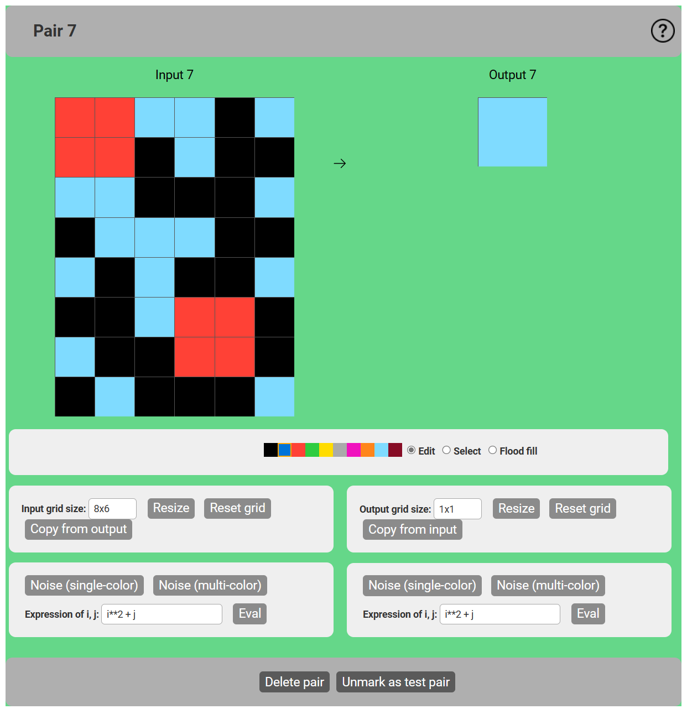
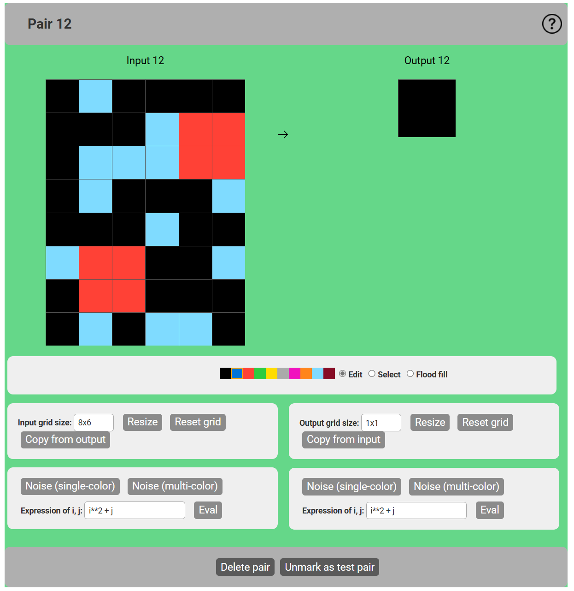

# Optional ARC (!!Work in Progress!!)

I am working on creating a dataset in a multiple-choice format based on the [Abstraction and Reasoning Challenge (ARC)](https://github.com/fchollet/ARC) !! However, it's still a work in progress!! So far, only the training data has been created. I aim to have answer options for the evaluation data by the end of November. It's quite an intensive task, so any assistance is warmly welcomed. However, to avoid redundancy, if you are willing to help, please contact me.

In my perspective, ARC can be divided into the following three steps:

1. Recognizing objects within the grid (e.g., there's a 3x2 red block, a 10x1 blue line, yellow noise, etc.).
2. Inferring the relationships between the recognized attributes.
3. Generating the answer grid based on these relationships. 

In ARC, the final answer was about grid generation. However, given the complexity of step 3 and my belief that human-like abstract reasoning can primarily be assessed in steps 1 and 2, I created this dataset. This idea primarily derives from introducing machine learning to tasks similar to raven's progressive matrices, such as the [Procedurally Generated Matrices (PGM)](https://github.com/google-deepmind/abstract-reasoning-matrices) and [RAVEN](https://github.com/WellyZhang/RAVEN). My goal is to solve ARC using Deep Learning, and it seems that PGM and RAVEN have been extensively researched in the Deep Learning domain. (Reference paper: [Deep Learning Methods for Abstract Visual Reasoning: A Survey on Raven's Progressive Matrices](https://arxiv.org/abs/2201.12382))

# Example
The example is shown using the test pair from /training/239be575.json.

* pair1~6: These are the input and output pairs for training, similar to the original ARC dataset.

* pair7: The first test pair. This output is the correct output for the test input.

* pair8~11: These pairs follow the first test pair and contain incorrect outputs for the initial input. While they resemble the correct output, there are subtle differences. Incorrect outputs always follow the correct pair and are stored in sets of 2x4=8.

* pair13: The second correct test pair. When there are more than two test pairs, this pair follows the previous set of incorrect outputs.

* pair14~18: Incorrect outputs for the second test pair. Incorrect outputs are always stored in sets of 2x4=8 after the correct pair.

# References

[1] https://github.com/fchollet/ARC  
[2] https://github.com/google-deepmind/abstract-reasoning-matrices  
[3] https://github.com/WellyZhang/RAVEN  
[4] https://arxiv.org/abs/2201.12382

*Note: This README.md has been machine-translated from JA_README.md.*

