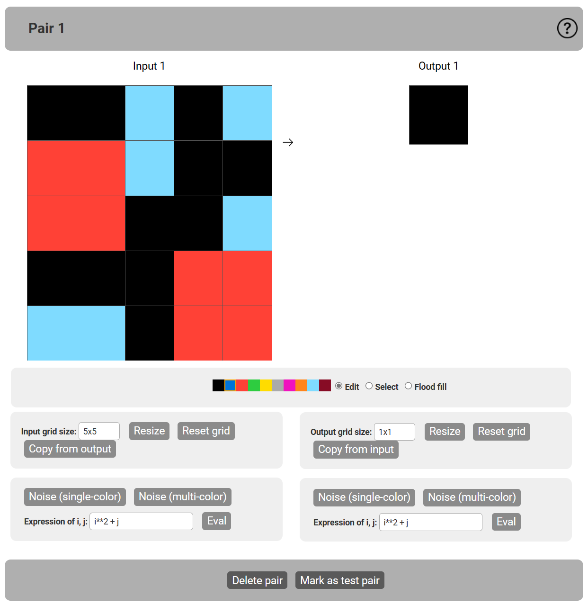
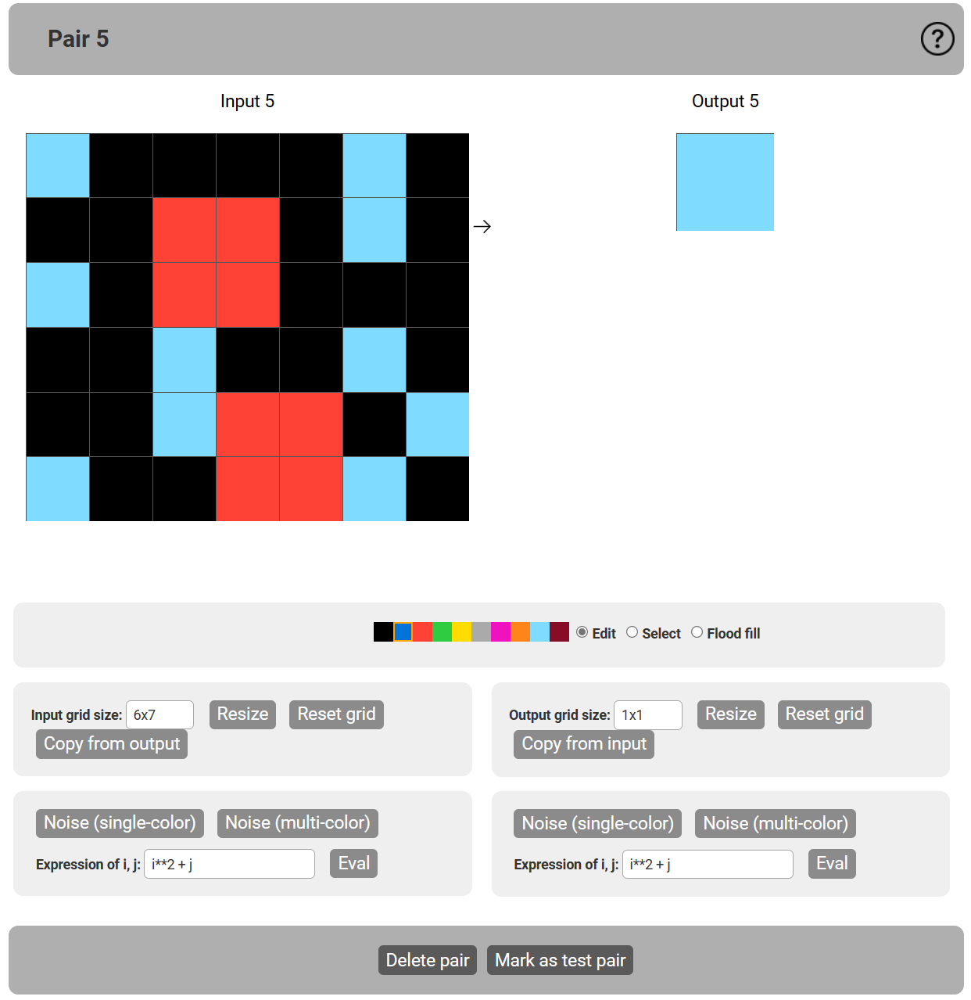
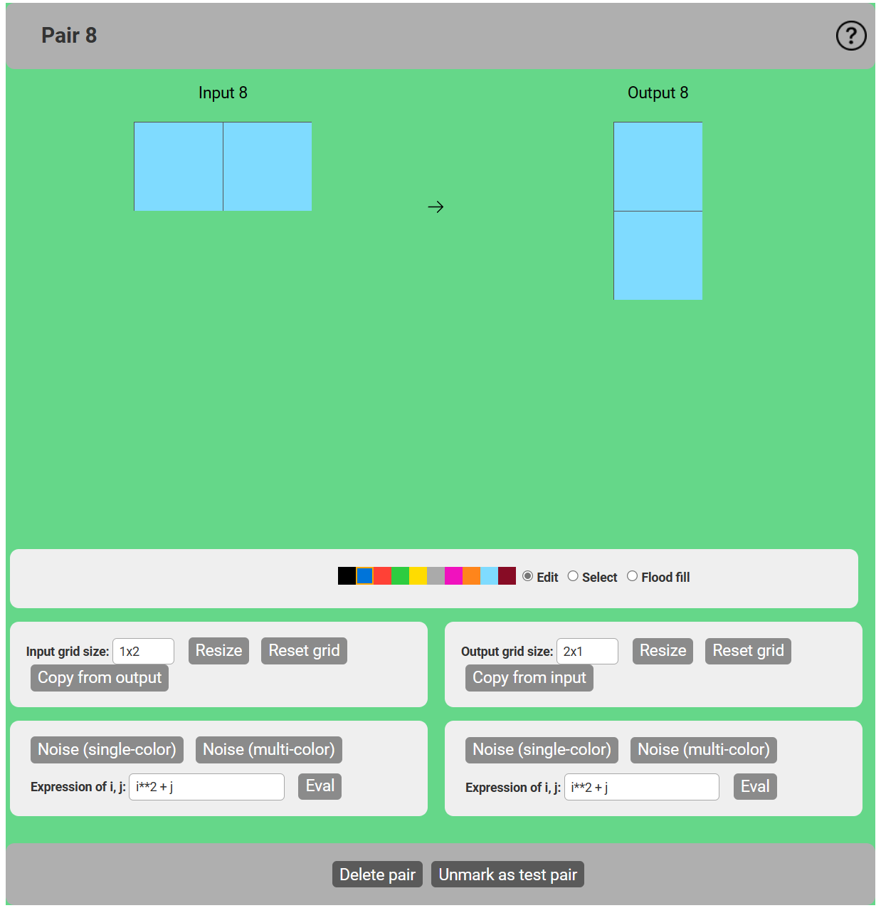
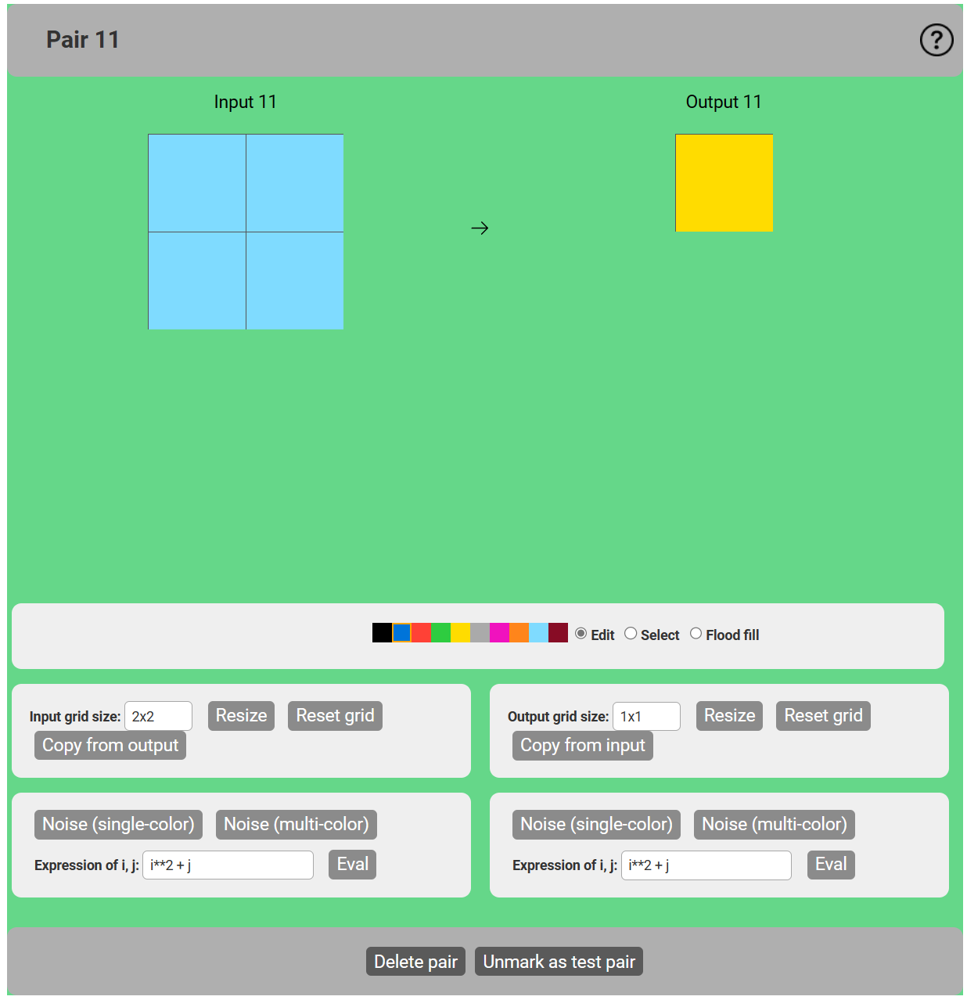
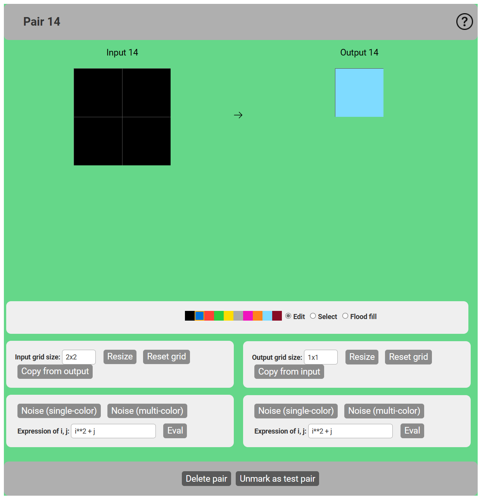
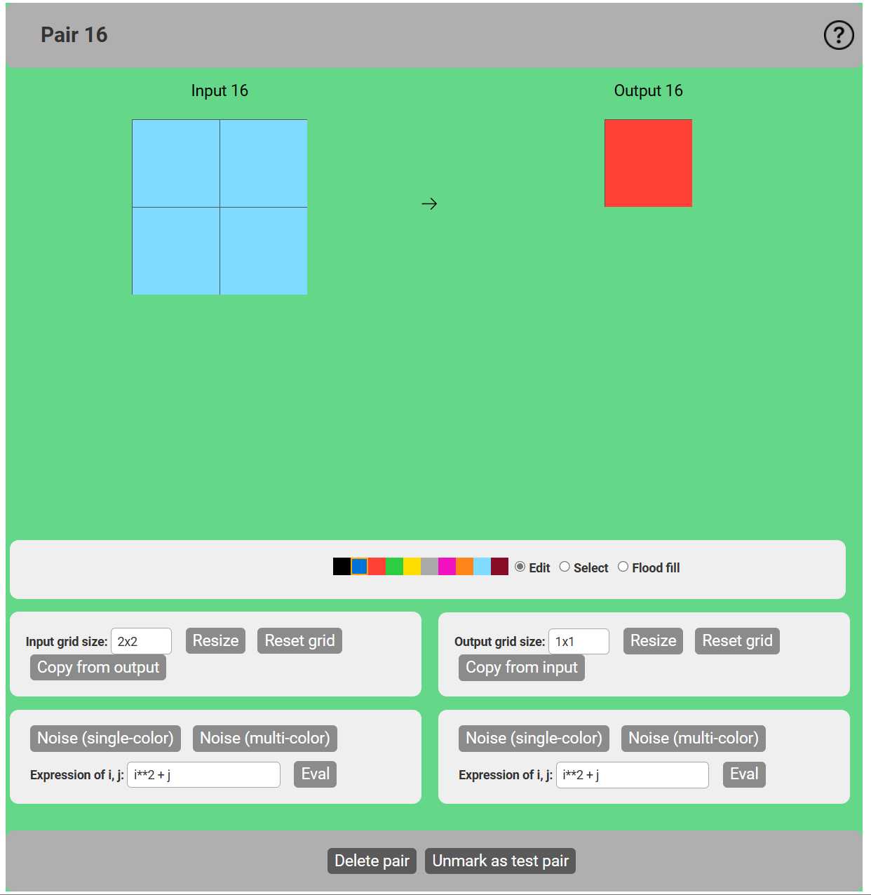

# Selective ARC

This dataset is a selective version of the [Abstraction and Reasoning Challenge (ARC)](https://github.com/fchollet/ARC).

In my view, ARC can be divided into the following three steps:

1. Recognition of objects within the grid. (e.g., a red 3x2 block, a blue 10x1 dividing line, yellow noise, etc.)
2. Deriving relationships between the recognized attributes.
3. Generating the answer grid based on the relationships.

In ARC, the final answer was the generation of a grid, but step 3 is complex, and I felt that human-like abstract reasoning, the main goal, could be measured in steps 1 and 2. Hence, I created this dataset. This idea is mainly based on Procedurally Generated Matrices (PGM) and [RAVEN](https://github.com/WellyZhang/RAVEN), which introduce Raven's progressive matrices into machine learning. I aim to solve ARC with Deep Learning, and PGM and RAVEN seem to be well researched in Deep Learning. (Reference paper: [Deep Learning Methods for Abstract Visual Reasoning: A Survey on Raven's Progressive Matrices](https://arxiv.org/abs/2201.12382))

# Directory Structure

The actual data for Selective ARC can be found at ☆.

**original_arc**  
The same as the data copied from the original ARC.
"data_for_editing," "training," and "evaluation" have added elements like id, name, and description, but they are not added here.

**data_for_editing**  
Data extended from original_arc for editing tasks and added id, name, description, etc., via make_data_for_arc_editor.py.
The extension of tasks and addition of id, name, and description were necessary for editing with [ARC Editor](https://arc-editor.lab42.global/editor).

**evaluation(☆)**  
Extended evaluation tasks. The way data is stored is explained in the example in the following paragraph.

**training(☆)**  
Extended training tasks. The way data is stored is explained in the example in the following paragraph.

**pictures**  
- Contains images for explanation.

**make_data_for_arc_editor.py**  
Python code to generate data_for_editing from original_arc for editing with [ARC Editor](https://arc-editor.lab42.global/editor).

**revision_memo.md**  
Memo of errors and ambiguities found during editing. Clear mistakes are edited in the evaluation.

**sanity_check.py**  
Checks the integrity of the created training and evaluation. It ensures no mistakes were made in copying from the original data_for_editing and that no incorrect outputs were created.

# Example
An example is shown with the test pair of /training/239be575.json.

* pair1~6: Train input and output pairs, same as the original ARC dataset.

* pair7: The first test pair. This output is the correct output for the test input.

* pair8~11: The following four pairs after the first test pair contain incorrect outputs for the first input. They resemble the correct output but have some different elements. Incorrect outputs are always stored after the correct pair, 2x4=8 in total.

* pair13: The second correct test pair. When there are two or more test pairs, they are stored following the previous set of incorrect outputs.

* pair14~18: Incorrect outputs for the second test pair. Incorrect outputs are always stored after the correct pair, 2x4=8 in total.

# References

[1] https://github.com/fchollet/ARC  
[2] https://github.com/google-deepmind/abstract-reasoning-matrices  
[3] https://github.com/WellyZhang/RAVEN  
[4] https://arxiv.org/abs/2201.12382

*Note: This README.md is a machine translation from JA_README.md.

---